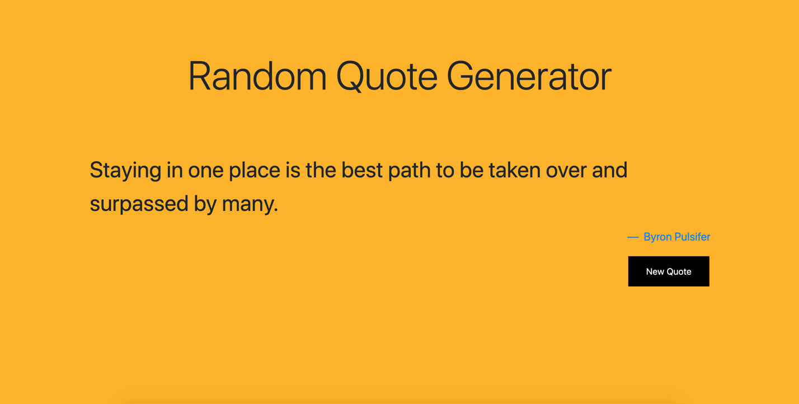

# Project Name

Inspirational Quote Generator

## Project Instructions

For this project, you will build a message generator program. Every time a user runs a program, they should get a new, randomized output.

You’re welcome to take the project in a couple of different forms, like an astrology generator, inspirational message, or nonsensical jokes.

To make your program truly random, the message that it outputs should be made up of at least three different pieces of data. Take what you know of JavaScript syntax so far to build the program and customize it to your liking.

#### Project Objectives:

- Build a message generator program using JavaScript
- Use Git version control
- Use command line
- Develop locally on your computer

#### Prerequisites:

- JavaScript
- Git and GitHub
- Command line

## Project Planning

- [x] - Have an api to get inspirational quotes from
  - [x] - https://type.fit/api/quotes
- [x] - Install vue.js
- [x] - Set up front end logic with vue.js
- [x] - Randomize index of api array
- [ ] - Scaffold website design with Bootstrap

## Table of contents

- [General info](#general-info)
- [Screenshots](#screenshots)
- [Technologies](#technologies)
- [Setup](#setup)
- [Status](#status)
- [Inspiration](#inspiration)
- [Contact](#contact)

## General info

The app generates a random quote after pressing the "new quote" button.

This is the project on the Full Stack Roadmap at Codecademy.

## Screenshots



## Technologies

Built with:

- HTML
- CSS
- Bootstrap - version 4.5.2
- Vue.js - version 2

## Setup

No local setup is required.

The live version of the app can be viewed here:
[Live Version](https://diamessogroup.github.io/Inspirational-Quote-Generator/)

## Code Examples

Fetching the API for quotes:

```javascript
fetchApi: () => {
  axios
    .get("https://type.fit/api/quotes")
    .then((response) => {
      let random = Math.floor(Math.random() * 1600);
      app.quote = response.data[random];
      app.apiData = response.data;
      return app.apiData;
    })
    .catch((error) => {
      console.log(error);
      this.errored = true;
    });
};
```

## Status

Project is: _in progress_
Working on the styling of the page

## Inspiration

Project assigned on the Full Stack Roadmap at Codecademy.

## Contact

Created by [krishna Diamesso](https://www.diamessoprojects.com)

- feel free to contact me!
